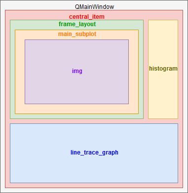

# Graphsaros


## About
Graphsaros is an open source data analysis tool for opening and viewing datafiles created by QCoDes/QtLab/Labber.

It allows user to do transformations on the data sets, export to matrix format, take arbitrary line traces, apply 
corrections, etc.
    
## Table of contents
- Requirements
- Installation
- Usage
- Contributing

## Requirements
- Python 3.6+
- PyQt5
- pyqtgraph
- NumPy
- pandas
- h5py

## Installation
All of the methods bellow assume that you have installed [python](https://www.python.org/downloads/) and [packages](https://packaging.python.org/tutorials/installing-packages/#use-pip-for-installing) 
mentioned in the **Requirements** section.
### GitBash
I would recommend obtaining the program using this method because it makes updating the program much easier then other 
methods.
1) Download and install [Git Bash](https://git-scm.com/downloads).
2) Open Git Bash, and [navigate](http://johnatten.com/2012/09/08/basic-git-command-line-reference-for-windows-users/#BASH-NAVIGATE-FILE-SYSTEM) to the destination where you wish to copy the project. (use **cd** command).
3) Go to the [project repository](https://github.com/kNalj/Graphsaros) and click the green "Clone or download" button.
   Copy displayed link.
4) In Git Bash type the following command: ```git clone https://github.com/username/example.git```.
   (where the example link is replaced with the link copied in step 3)
### Download ZIP
1) Go to the [project repository](https://github.com/kNalj/Graphsaros) and click the green "Clone or download" button.
   Click download as ZIP.
2) Extract the compressed file to a desired location.

### Call a friend to do it for you
1) Pick up your phone
2) Look trough your contacts until you find a person that might know how to do this
3) Dial friends number and ask for a favor
4) If the program is not installed within next 30 minutes, go back to step 1
## Usage
    TODO: Insert text

## Contributing
### Main window
### Heatmap window

### Line trace window